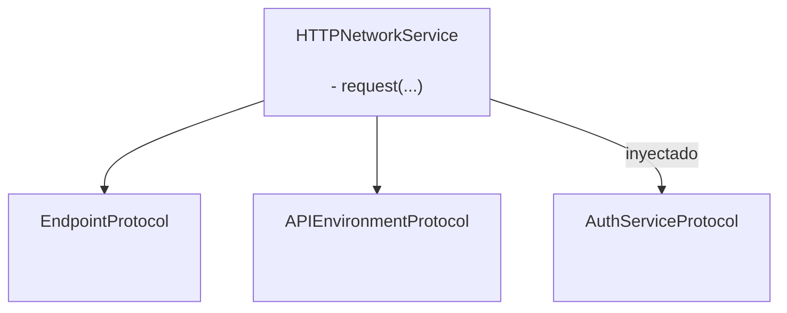
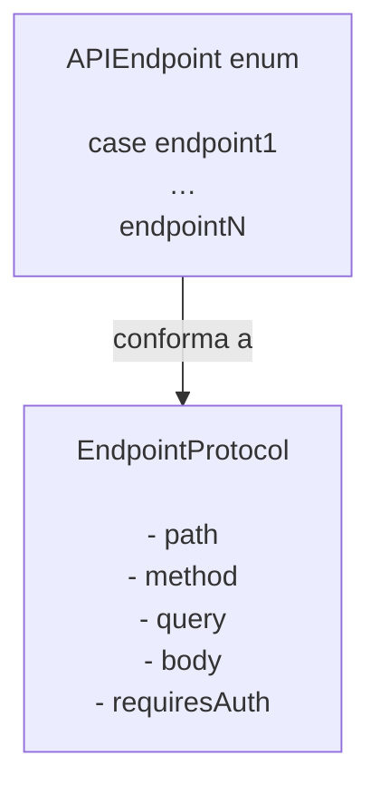

# GentleNetworking

Una biblioteca de networking ligera, lista para Swift 6, diseñada para apps iOS modernas con `async/await`, arquitectura limpia y abstracciones testeables.

> 🌍 **Idioma** · [English](../README.md) · Español · [Português (Brasil)](README.pt-BR.md) · [日本語](README.ja.md)

[](https://github.com/gentle-giraffe-apps/GentleNetworking/actions/workflows/ci.yml?query=branch%3Amain)
[](https://codecov.io/gh/gentle-giraffe-apps/GentleNetworking)
[](https://swift.org)
[](https://swift.org/package-manager/)
[](https://developer.apple.com/ios/)


[](https://deepsource.io/)
[](https://app.deepsource.com/gh/gentle-giraffe-apps/GentleNetworking/)

---

## ✨ Características

- ✅ API nativa con `async/await`
- ✅ Capa de networking basada en protocolos, completamente mockeable
- ✅ Decodificación tipada de request / response
- ✅ Compatible con Swift 6 + Swift Concurrency
- ✅ Diseñada para MVVM / Clean Architecture
- ✅ Sin dependencias de terceros
- ✅ Transports con respuestas predefinidas para testing

💬 **[Únete a la discusión. Comentarios y preguntas son bienvenidos](https://github.com/gentle-giraffe-apps/GentleNetworking/discussions)**

---

## App de Demostración

Se incluye una app de demostración en SwiftUI en este repositorio usando una referencia local al paquete.

### Cómo Ejecutar
1. Clona el repositorio:
   ```bash
   git clone https://github.com/gentle-giraffe-apps/GentleNetworking.git
   ```
2. Abre el proyecto de demostración:
   ```
   Demo/GentleNetworkingDemo/GentleNetworkingDemo.xcodeproj
   ```
3. Selecciona un simulador con iOS 17+.
4. Compila y ejecuta (⌘R).

El proyecto viene preconfigurado con una referencia local al paquete Swift `GentleNetworking` y debería funcionar sin configuración adicional.

---

## 📦 Instalación (Swift Package Manager)

### Vía Xcode

1. Abre tu proyecto en Xcode
2. Ve a **File → Add Packages...**
3. Ingresa la URL del repositorio: `https://github.com/gentle-giraffe-apps/GentleNetworking.git`
4. Elige una regla de versión (o `main` durante el desarrollo)
5. Agrega el producto **GentleNetworking** a tu target

### Vía Package.swift

Agrega la dependencia a tu `Package.swift`:

``` swift
dependencies: [
    .package(url: "https://github.com/gentle-giraffe-apps/GentleNetworking.git", from: "1.0.0")
]
```

Luego agrega `"GentleNetworking"` al target que lo necesite:

``` swift
.target(
    name: "YourApp",
    dependencies: ["GentleNetworking"]
)
```

---

## Calidad y Herramientas

Este proyecto aplica controles de calidad mediante CI y análisis estático:

- **CI:** Todos los commits a `main` deben pasar las verificaciones de GitHub Actions
- **Análisis estático:** DeepSource se ejecuta en cada commit a `main`.
  El badge indica el número actual de issues de análisis estático pendientes.
- **Cobertura de tests:** Codecov reporta la cobertura de líneas para la rama `main`

<sub><strong>Snapshot de Codecov</strong></sub><br/>
<a href="https://codecov.io/gh/gentle-giraffe-apps/GentleNetworking"></a>

Estas verificaciones están diseñadas para mantener el sistema seguro a medida que evoluciona.

---

## Arquitectura

GentleNetworking está centrado en un único `HTTPNetworkService` basado en protocolos que coordina las peticiones usando abstracciones inyectadas de endpoint, entorno y autenticación.



### Endpoint



## 🚀 Uso Básico

### 1. Definir una API y Endpoints

``` swift
import GentleNetworking

let apiEnvironment = DefaultAPIEnvironment(
    baseURL: URL(string: "https://api.company.com")
)

nonisolated enum APIEndpoint: EndpointProtocol {
    case signIn(username: String, password: String)
    case model(id: Int)
    case models

    var path: String {
        switch self {
        case .signIn: "/api/signIn"
        case .model(let id): "/api/model/\(id)"
        case .models: "/api/models"
        }
    }

    var method: HTTPMethod {
        switch self {
        case .signIn: .post
        case .model, .models: .get
        }
    }

    var query: [URLQueryItem]? {
        switch self {
        case .signIn, .model, .models: nil
        }
    }

    var body: [String: EndpointAnyEncodable]? {
        switch self {
        case .signIn(let username, let password): [
            "username": EndpointAnyEncodable(username),
            "password": EndpointAnyEncodable(password)
        ]
        case .model, .models: nil
        }
    }

    var requiresAuth: Bool {
        switch self {
        case .model, .models: true
        case .signIn(username: _, password: _): false
        }
    }
}
```

---

### 2. Crear un Network Service

``` swift
let networkService = HTTPNetworkService()
```

---

### 3. Autenticarse si es Necesario

`SystemKeyChainAuthService` es la implementación integrada de `AuthServiceProtocol`. Almacena un token Bearer en el keychain del sistema y lo adjunta automáticamente a las peticiones de endpoints donde `requiresAuth` es `true`.

``` swift
let keyChainAuthService = SystemKeyChainAuthService()

struct AuthTokenModel: Decodable, Sendable {
    let token: String
}

let authTokenModel: AuthTokenModel = try await networkService.request(
    to: .signIn(username: "user", password: "pass"),
    via: apiEnvironment
)

try await keyChainAuthService.saveAccessToken(
    authTokenModel.token
)
```

---
### 4. Solicitar un Modelo

Usa `request` para decodificar un único objeto de la respuesta:

``` swift
struct Model: Decodable, Sendable {
    let id: Int
    let property: String
}

let model: Model = try await networkService.request(
    to: .model(id: 123),
    via: apiEnvironment
)
```

---
### 5. Solicitar un Array de Modelos

Usa `requestModels` para decodificar un array de objetos de la respuesta:

``` swift
let models: [Model] = try await networkService.requestModels(
    to: .models,
    via: apiEnvironment
)
```

---

## 🧪 Testing

GentleNetworking proporciona una abstracción en la capa de transporte para facilitar el mocking en tests.

### CannedResponseTransport

Retorna una respuesta fija para cualquier petición:

``` swift
let transport = CannedResponseTransport(
    string: #"{"id": 1, "title": "Test"}"#,
    statusCode: 200
)

let networkService = HTTPNetworkService(transport: transport)
```

### CannedRoutesTransport

Asocia peticiones por método y patrón de ruta para escenarios de test más realistas:

``` swift
let transport = CannedRoutesTransport(routes: [
    CannedRoute(
        pattern: RequestPattern(method: .get, path: "/api/models"),
        response: CannedResponse(string: #"[{"id": 1}]"#)
    ),
    CannedRoute(
        pattern: RequestPattern(method: .post, pathRegex: "^/api/model/\\d+$"),
        response: CannedResponse(string: #"{"success": true}"#)
    )
])

let networkService = HTTPNetworkService(transport: transport)
```

---

## 🧭 Filosofía de Diseño

GentleNetworking está construido alrededor de:

- ✅ Predictibilidad sobre magia
- ✅ Diseño basado en protocolos
- ✅ Inyección de dependencias explícita
- ✅ Concurrencia moderna de Swift
- ✅ Testeabilidad por defecto
- ✅ Superficie de API pequeña con garantías sólidas

Es intencionalmente mínimo y evita sobre-abstraer u ocultar el comportamiento de networking.

---

## 🤖 Nota sobre Herramientas

Partes de la redacción y el refinamiento editorial en este repositorio fueron acelerados usando modelos de lenguaje grandes (incluyendo ChatGPT, Claude y Gemini) bajo diseño humano directo, validación y aprobación final. Todas las decisiones técnicas, código y conclusiones arquitectónicas son autoría y están verificadas por el mantenedor del repositorio.

---

## 🔐 Licencia

Licencia MIT
Libre para uso personal y comercial.

---

## 👤 Autor

Creado por **Jonathan Ritchey**
Gentle Giraffe Apps
Senior iOS Engineer --- Swift | SwiftUI | Concurrency


