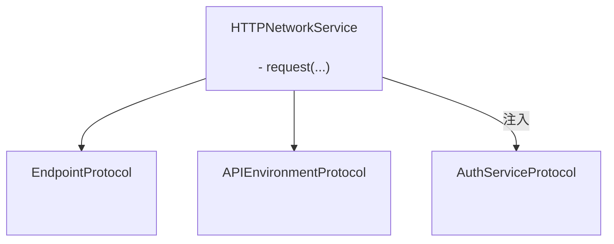
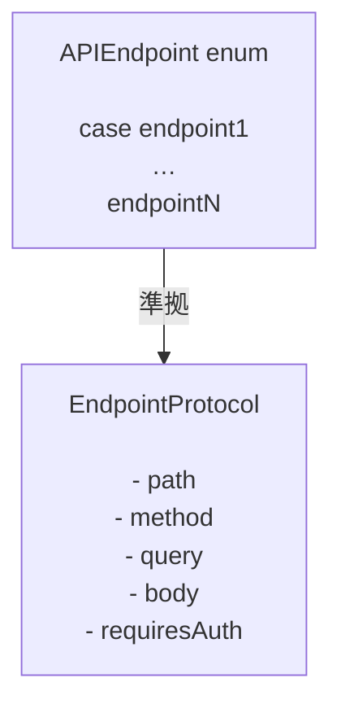

# GentleNetworking

`async/await`、クリーンアーキテクチャ、テスト可能な抽象化を使用した、モダンなiOSアプリ向けの軽量でSwift 6対応のネットワーキングライブラリです。

> 🌍 **言語** · [English](../README.md) · [Español](README.es.md) · [Português (Brasil)](README.pt-BR.md) · 日本語 · [简体中文](README.zh-CN.md) · [한국어](README.ko.md) · [Русский](README.ru.md)

[](https://github.com/gentle-giraffe-apps/GentleNetworking/actions/workflows/ci.yml?query=branch%3Amain)
[](https://codecov.io/gh/gentle-giraffe-apps/GentleNetworking)
[](https://swift.org)
[](https://swift.org/package-manager/)
[](https://developer.apple.com/ios/)


[](https://deepsource.io/)
[](https://app.deepsource.com/gh/gentle-giraffe-apps/GentleNetworking/)

---

## ✨ 特徴

- ✅ ネイティブ `async/await` API
- ✅ プロトコルベースで完全にモック可能なネットワーキング層
- ✅ 型付きリクエスト / レスポンスのデコード
- ✅ Swift 6 + Swift Concurrency 対応
- ✅ MVVM / Clean Architecture 向けに設計
- ✅ サードパーティ依存なし
- ✅ テスト用の定型レスポンストランスポートを内蔵

💬 **[ディスカッションに参加しましょう。フィードバックや質問を歓迎します](https://github.com/gentle-giraffe-apps/GentleNetworking/discussions)**

---

## デモアプリ

ローカルパッケージ参照を使用した、実行可能なSwiftUIデモアプリがこのリポジトリに含まれています。

### 実行方法
1. リポジトリをクローンします：
   ```bash
   git clone https://github.com/gentle-giraffe-apps/GentleNetworking.git
   ```
2. デモプロジェクトを開きます：
   ```
   Demo/GentleNetworkingDemo/GentleNetworkingDemo.xcodeproj
   ```
3. iOS 17以上のシミュレータを選択します。
4. ビルド＆実行（⌘R）。

プロジェクトは`GentleNetworking`へのローカルSwift Package参照で事前設定されており、追加の設定なしで実行できます。

---

## 📦 インストール（Swift Package Manager）

### Xcode経由

1. Xcodeでプロジェクトを開く
2. **File → Add Packages...** に移動
3. リポジトリURLを入力：`https://github.com/gentle-giraffe-apps/GentleNetworking.git`
4. バージョンルールを選択（開発中は`main`も可）
5. **GentleNetworking**プロダクトをアプリターゲットに追加

### Package.swift経由

`Package.swift`に依存関係を追加します：

``` swift
dependencies: [
    .package(url: "https://github.com/gentle-giraffe-apps/GentleNetworking.git", from: "1.0.0")
]
```

次に、必要なターゲットに`"GentleNetworking"`を追加します：

``` swift
.target(
    name: "YourApp",
    dependencies: ["GentleNetworking"]
)
```

---

## 品質とツール

このプロジェクトはCIと静的解析による品質ゲートを適用しています：

- **CI:** `main`へのすべてのコミットはGitHub Actionsのチェックに合格する必要があります
- **静的解析:** DeepSourceが`main`へのすべてのコミットで実行されます。
  バッジは現在の未解決の静的解析issueの数を示しています。
- **テストカバレッジ:** Codecovが`main`ブランチの行カバレッジを報告します

<sub><strong>Codecovスナップショット</strong></sub><br/>
<a href="https://codecov.io/gh/gentle-giraffe-apps/GentleNetworking"></a>

これらのチェックは、設計システムを安全に進化させ続けるためのものです。

---

## アーキテクチャ

GentleNetworkingは、注入されたエンドポイント、環境、認証の抽象化を使用してリクエストを調整する、単一のプロトコル駆動型`HTTPNetworkService`を中心に構築されています。



### エンドポイント



## 🚀 基本的な使い方

### 1. APIとエンドポイントを定義する

``` swift
import GentleNetworking

let apiEnvironment = DefaultAPIEnvironment(
    baseURL: URL(string: "https://api.company.com")
)

nonisolated enum APIEndpoint: EndpointProtocol {
    case signIn(username: String, password: String)
    case model(id: Int)
    case models

    var path: String {
        switch self {
        case .signIn: "/api/signIn"
        case .model(let id): "/api/model/\(id)"
        case .models: "/api/models"
        }
    }

    var method: HTTPMethod {
        switch self {
        case .signIn: .post
        case .model, .models: .get
        }
    }

    var query: [URLQueryItem]? {
        switch self {
        case .signIn, .model, .models: nil
        }
    }

    var body: [String: EndpointAnyEncodable]? {
        switch self {
        case .signIn(let username, let password): [
            "username": EndpointAnyEncodable(username),
            "password": EndpointAnyEncodable(password)
        ]
        case .model, .models: nil
        }
    }

    var requiresAuth: Bool {
        switch self {
        case .model, .models: true
        case .signIn(username: _, password: _): false
        }
    }
}
```

---

### 2. ネットワークサービスを作成する

``` swift
let networkService = HTTPNetworkService()
```

---

### 3. 必要に応じて認証する

`SystemKeyChainAuthService`は`AuthServiceProtocol`の組み込み実装です。システムキーチェーンにBearerトークンを保存し、`requiresAuth`が`true`のエンドポイントへのリクエストに自動的にトークンを付加します。

``` swift
let keyChainAuthService = SystemKeyChainAuthService()

struct AuthTokenModel: Decodable, Sendable {
    let token: String
}

let authTokenModel: AuthTokenModel = try await networkService.request(
    to: .signIn(username: "user", password: "pass"),
    via: apiEnvironment
)

try await keyChainAuthService.saveAccessToken(
    authTokenModel.token
)
```

---
### 4. モデルをリクエストする

`request`を使用してレスポンスから単一のオブジェクトをデコードします：

``` swift
struct Model: Decodable, Sendable {
    let id: Int
    let property: String
}

let model: Model = try await networkService.request(
    to: .model(id: 123),
    via: apiEnvironment
)
```

---
### 5. モデルの配列をリクエストする

`requestModels`を使用してレスポンスからオブジェクトの配列をデコードします：

``` swift
let models: [Model] = try await networkService.requestModels(
    to: .models,
    via: apiEnvironment
)
```

---

## 🧪 テスト

GentleNetworkingは、テストでのモックを容易にするトランスポート層の抽象化を提供します。

### CannedResponseTransport

任意のリクエストに対して固定レスポンスを返します：

``` swift
let transport = CannedResponseTransport(
    string: #"{"id": 1, "title": "Test"}"#,
    statusCode: 200
)

let networkService = HTTPNetworkService(transport: transport)
```

### CannedRoutesTransport

より現実的なテストシナリオのために、メソッドとパスパターンでリクエストをマッチングします：

``` swift
let transport = CannedRoutesTransport(routes: [
    CannedRoute(
        pattern: RequestPattern(method: .get, path: "/api/models"),
        response: CannedResponse(string: #"[{"id": 1}]"#)
    ),
    CannedRoute(
        pattern: RequestPattern(method: .post, pathRegex: "^/api/model/\\d+$"),
        response: CannedResponse(string: #"{"success": true}"#)
    )
])

let networkService = HTTPNetworkService(transport: transport)
```

---

## 🧭 設計哲学

GentleNetworkingは以下を中心に構築されています：

- ✅ マジックよりも予測可能性
- ✅ プロトコル駆動型設計
- ✅ 明示的な依存性注入
- ✅ モダンなSwift並行処理
- ✅ デフォルトでテスト可能
- ✅ 強力な保証を備えた小さなAPI表面

意図的にミニマルであり、ネットワーキングの振る舞いを過度に抽象化したり隠したりすることを避けています。

---

## 🤖 ツールに関する注記

このリポジトリの起草および編集の改善の一部は、大規模言語モデル（ChatGPT、Claude、Geminiを含む）を使用して加速されましたが、直接的な人間の設計、検証、最終承認の下で行われています。すべての技術的判断、コード、アーキテクチャの結論はリポジトリのメンテナーによって作成・検証されています。

---

## 🔐 ライセンス

MITライセンス
個人利用・商用利用ともに無料です。

---

## 👤 作者

**Jonathan Ritchey** によって構築
Gentle Giraffe Apps
Senior iOS Engineer --- Swift | SwiftUI | Concurrency


