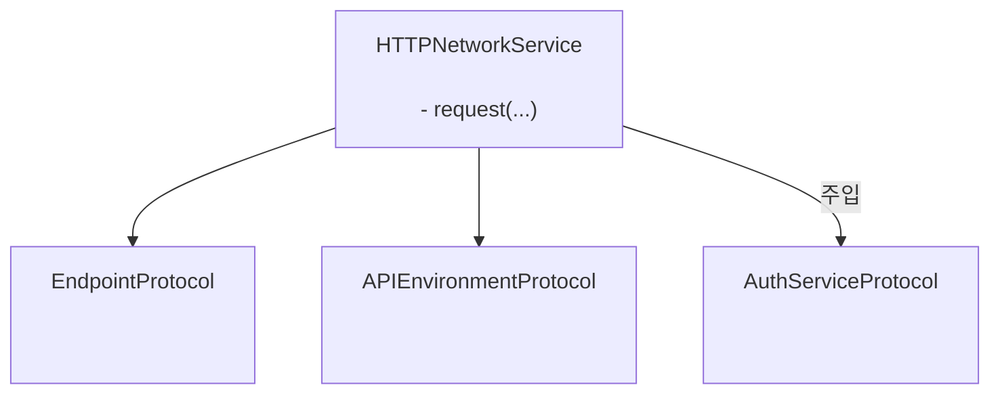
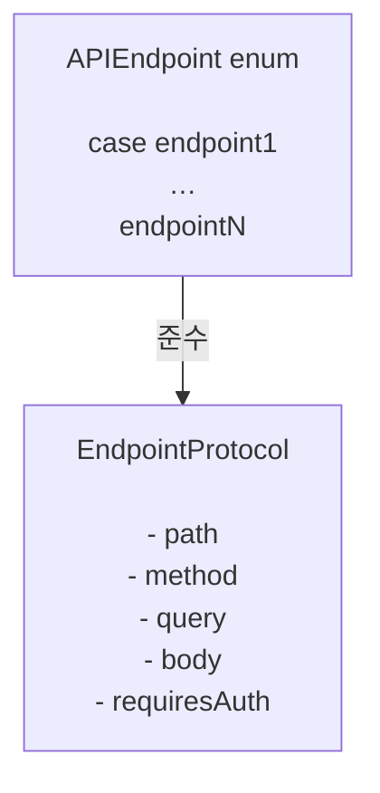

# GentleNetworking

`async/await`, 클린 아키텍처, 테스트 가능한 추상화를 사용하는 현대적인 iOS 앱을 위한 경량 Swift 6 지원 네트워킹 라이브러리입니다.

> 🌍 **언어** · [English](../README.md) · [Español](README.es.md) · [Português (Brasil)](README.pt-BR.md) · [日本語](README.ja.md) · [简体中文](README.zh-CN.md) · 한국어 · [Русский](README.ru.md)

[](https://github.com/gentle-giraffe-apps/GentleNetworking/actions/workflows/ci.yml?query=branch%3Amain)
[](https://codecov.io/gh/gentle-giraffe-apps/GentleNetworking)
[](https://swift.org)
[](https://swift.org/package-manager/)
[](https://developer.apple.com/ios/)


[](https://deepsource.io/)
[](https://app.deepsource.com/gh/gentle-giraffe-apps/GentleNetworking/)

---

## ✨ 특징

- ✅ 네이티브 `async/await` API
- ✅ 프로토콜 기반의 완전히 Mock 가능한 네트워킹 계층
- ✅ 타입 기반 요청 / 응답 디코딩
- ✅ Swift 6 + Swift Concurrency 호환
- ✅ MVVM / Clean Architecture에 맞게 설계
- ✅ 서드파티 의존성 없음
- ✅ 테스트를 위한 미리 정의된 응답 Transport 내장

💬 **[토론에 참여하세요. 피드백과 질문을 환영합니다](https://github.com/gentle-giraffe-apps/GentleNetworking/discussions)**

---

## 데모 앱

로컬 패키지 참조를 사용하는 실행 가능한 SwiftUI 데모 앱이 이 저장소에 포함되어 있습니다.

### 실행 방법
1. 저장소를 클론합니다:
   ```bash
   git clone https://github.com/gentle-giraffe-apps/GentleNetworking.git
   ```
2. 데모 프로젝트를 엽니다:
   ```
   Demo/GentleNetworkingDemo/GentleNetworkingDemo.xcodeproj
   ```
3. iOS 17+ 시뮬레이터를 선택합니다.
4. 빌드 및 실행 (⌘R).

프로젝트는 `GentleNetworking`에 대한 로컬 Swift Package 참조로 사전 구성되어 있으며, 추가 설정 없이 실행할 수 있습니다.

---

## 📦 설치 (Swift Package Manager)

### Xcode를 통한 설치

1. Xcode에서 프로젝트를 엽니다
2. **File → Add Packages...** 로 이동합니다
3. 저장소 URL을 입력합니다: `https://github.com/gentle-giraffe-apps/GentleNetworking.git`
4. 버전 규칙을 선택합니다 (개발 중에는 `main`도 가능)
5. **GentleNetworking** 제품을 앱 타겟에 추가합니다

### Package.swift를 통한 설치

`Package.swift`에 의존성을 추가합니다:

``` swift
dependencies: [
    .package(url: "https://github.com/gentle-giraffe-apps/GentleNetworking.git", from: "1.0.0")
]
```

그런 다음 필요한 타겟에 `"GentleNetworking"`을 추가합니다:

``` swift
.target(
    name: "YourApp",
    dependencies: ["GentleNetworking"]
)
```

---

## 품질 및 도구

이 프로젝트는 CI와 정적 분석을 통해 품질 게이트를 적용합니다:

- **CI:** `main`에 대한 모든 커밋은 GitHub Actions 검사를 통과해야 합니다
- **정적 분석:** DeepSource가 `main`에 대한 모든 커밋에서 실행됩니다.
  배지는 현재 미해결 정적 분석 이슈 수를 나타냅니다.
- **테스트 커버리지:** Codecov가 `main` 브랜치의 라인 커버리지를 보고합니다

<sub><strong>Codecov 스냅샷</strong></sub><br/>
<a href="https://codecov.io/gh/gentle-giraffe-apps/GentleNetworking"></a>

이러한 검사는 설계 시스템이 안전하게 발전할 수 있도록 하기 위한 것입니다.

---

## 아키텍처

GentleNetworking은 주입된 엔드포인트, 환경, 인증 추상화를 사용하여 요청을 조율하는 단일 프로토콜 기반 `HTTPNetworkService`를 중심으로 구축되었습니다.



### 엔드포인트



## 🚀 기본 사용법

### 1. API와 엔드포인트 정의

``` swift
import GentleNetworking

let apiEnvironment = DefaultAPIEnvironment(
    baseURL: URL(string: "https://api.company.com")
)

nonisolated enum APIEndpoint: EndpointProtocol {
    case signIn(username: String, password: String)
    case model(id: Int)
    case models

    var path: String {
        switch self {
        case .signIn: "/api/signIn"
        case .model(let id): "/api/model/\(id)"
        case .models: "/api/models"
        }
    }

    var method: HTTPMethod {
        switch self {
        case .signIn: .post
        case .model, .models: .get
        }
    }

    var query: [URLQueryItem]? {
        switch self {
        case .signIn, .model, .models: nil
        }
    }

    var body: [String: EndpointAnyEncodable]? {
        switch self {
        case .signIn(let username, let password): [
            "username": EndpointAnyEncodable(username),
            "password": EndpointAnyEncodable(password)
        ]
        case .model, .models: nil
        }
    }

    var requiresAuth: Bool {
        switch self {
        case .model, .models: true
        case .signIn(username: _, password: _): false
        }
    }
}
```

---

### 2. 네트워크 서비스 생성

``` swift
let networkService = HTTPNetworkService()
```

---

### 3. 필요시 인증

`SystemKeyChainAuthService`는 `AuthServiceProtocol`의 내장 구현입니다. 시스템 키체인에 Bearer 토큰을 저장하고, `requiresAuth`가 `true`인 엔드포인트 요청에 자동으로 토큰을 첨부합니다.

``` swift
let keyChainAuthService = SystemKeyChainAuthService()

struct AuthTokenModel: Decodable, Sendable {
    let token: String
}

let authTokenModel: AuthTokenModel = try await networkService.request(
    to: .signIn(username: "user", password: "pass"),
    via: apiEnvironment
)

try await keyChainAuthService.saveAccessToken(
    authTokenModel.token
)
```

---
### 4. 모델 요청

`request`를 사용하여 응답에서 단일 객체를 디코딩합니다:

``` swift
struct Model: Decodable, Sendable {
    let id: Int
    let property: String
}

let model: Model = try await networkService.request(
    to: .model(id: 123),
    via: apiEnvironment
)
```

---
### 5. 모델 배열 요청

`requestModels`를 사용하여 응답에서 객체 배열을 디코딩합니다:

``` swift
let models: [Model] = try await networkService.requestModels(
    to: .models,
    via: apiEnvironment
)
```

---

## 🧪 테스트

GentleNetworking은 테스트에서 Mock을 쉽게 할 수 있도록 전송 계층 추상화를 제공합니다.

### CannedResponseTransport

모든 요청에 대해 고정된 응답을 반환합니다:

``` swift
let transport = CannedResponseTransport(
    string: #"{"id": 1, "title": "Test"}"#,
    statusCode: 200
)

let networkService = HTTPNetworkService(transport: transport)
```

### CannedRoutesTransport

보다 현실적인 테스트 시나리오를 위해 메서드와 경로 패턴으로 요청을 매칭합니다:

``` swift
let transport = CannedRoutesTransport(routes: [
    CannedRoute(
        pattern: RequestPattern(method: .get, path: "/api/models"),
        response: CannedResponse(string: #"[{"id": 1}]"#)
    ),
    CannedRoute(
        pattern: RequestPattern(method: .post, pathRegex: "^/api/model/\\d+$"),
        response: CannedResponse(string: #"{"success": true}"#)
    )
])

let networkService = HTTPNetworkService(transport: transport)
```

---

## 🧭 설계 철학

GentleNetworking은 다음을 중심으로 구축되었습니다:

- ✅ 마법보다 예측 가능성
- ✅ 프로토콜 기반 설계
- ✅ 명시적 의존성 주입
- ✅ 현대적인 Swift 동시성
- ✅ 기본적으로 테스트 가능
- ✅ 강력한 보증을 갖춘 작은 API 표면

의도적으로 최소한을 유지하며, 네트워킹 동작을 과도하게 추상화하거나 숨기는 것을 피합니다.

---

## 🤖 도구 관련 참고

이 저장소의 초안 작성 및 편집 개선의 일부는 대규모 언어 모델(ChatGPT, Claude, Gemini 포함)을 사용하여 가속되었으며, 직접적인 인간 설계, 검증 및 최종 승인 하에 이루어졌습니다. 모든 기술적 결정, 코드, 아키텍처 결론은 저장소 관리자가 작성하고 검증했습니다.

---

## 🔐 라이선스

MIT 라이선스
개인 및 상업적 용도로 무료로 사용할 수 있습니다.

---

## 👤 저자

**Jonathan Ritchey** 제작
Gentle Giraffe Apps
Senior iOS Engineer --- Swift | SwiftUI | Concurrency


