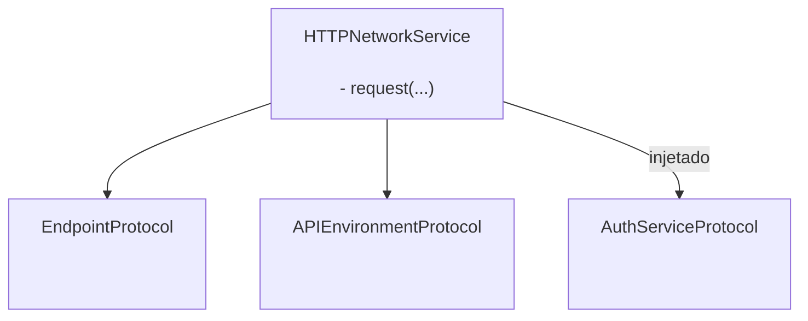
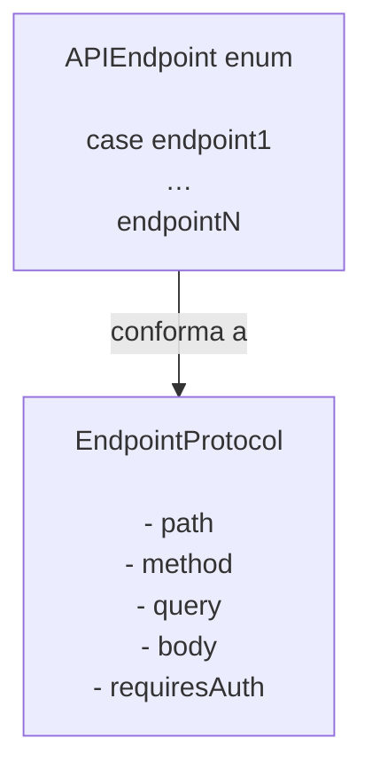

# GentleNetworking

Uma biblioteca de networking leve, pronta para Swift 6, projetada para apps iOS modernos usando `async/await`, arquitetura limpa e abstrações testáveis.

> 🌍 **Idioma** · [English](../README.md) · [Español](README.es.md) · Português (Brasil) · [日本語](README.ja.md) · [简体中文](README.zh-CN.md) · [한국어](README.ko.md) · [Русский](README.ru.md)

[](https://github.com/gentle-giraffe-apps/GentleNetworking/actions/workflows/ci.yml?query=branch%3Amain)
[](https://codecov.io/gh/gentle-giraffe-apps/GentleNetworking)
[](https://swift.org)
[](https://swift.org/package-manager/)
[](https://developer.apple.com/ios/)


[](https://deepsource.io/)
[](https://app.deepsource.com/gh/gentle-giraffe-apps/GentleNetworking/)

---

## ✨ Funcionalidades

- ✅ API nativa com `async/await`
- ✅ Camada de networking baseada em protocolos, totalmente mockável
- ✅ Decodificação tipada de request / response
- ✅ Compatível com Swift 6 + Swift Concurrency
- ✅ Projetada para MVVM / Clean Architecture
- ✅ Zero dependências de terceiros
- ✅ Transports com respostas predefinidas para testes

💬 **[Participe da discussão. Feedback e perguntas são bem-vindos](https://github.com/gentle-giraffe-apps/GentleNetworking/discussions)**

---

## App de Demonstração

Uma app de demonstração em SwiftUI executável está incluída neste repositório usando uma referência local ao pacote.

### Como Executar
1. Clone o repositório:
   ```bash
   git clone https://github.com/gentle-giraffe-apps/GentleNetworking.git
   ```
2. Abra o projeto de demonstração:
   ```
   Demo/GentleNetworkingDemo/GentleNetworkingDemo.xcodeproj
   ```
3. Selecione um simulador com iOS 17+.
4. Compile e execute (⌘R).

O projeto vem pré-configurado com uma referência local ao pacote Swift `GentleNetworking` e deve funcionar sem configuração adicional.

---

## 📦 Instalação (Swift Package Manager)

### Via Xcode

1. Abra seu projeto no Xcode
2. Vá em **File → Add Packages...**
3. Insira a URL do repositório: `https://github.com/gentle-giraffe-apps/GentleNetworking.git`
4. Escolha uma regra de versão (ou `main` durante o desenvolvimento)
5. Adicione o produto **GentleNetworking** ao seu target

### Via Package.swift

Adicione a dependência ao seu `Package.swift`:

``` swift
dependencies: [
    .package(url: "https://github.com/gentle-giraffe-apps/GentleNetworking.git", from: "1.0.0")
]
```

Em seguida, adicione `"GentleNetworking"` ao target que precisar:

``` swift
.target(
    name: "YourApp",
    dependencies: ["GentleNetworking"]
)
```

---

## Qualidade e Ferramentas

Este projeto aplica controles de qualidade via CI e análise estática:

- **CI:** Todos os commits em `main` devem passar nas verificações do GitHub Actions
- **Análise estática:** DeepSource é executado em cada commit em `main`.
  O badge indica o número atual de issues de análise estática pendentes.
- **Cobertura de testes:** Codecov reporta a cobertura de linhas para a branch `main`

<sub><strong>Snapshot do Codecov</strong></sub><br/>
<a href="https://codecov.io/gh/gentle-giraffe-apps/GentleNetworking"></a>

Essas verificações são projetadas para manter o sistema seguro à medida que evolui.

---

## Arquitetura

GentleNetworking é centrado em um único `HTTPNetworkService` baseado em protocolos que coordena as requisições usando abstrações injetadas de endpoint, ambiente e autenticação.



### Endpoint



## 🚀 Uso Básico

### 1. Definir uma API e Endpoints

``` swift
import GentleNetworking

let apiEnvironment = DefaultAPIEnvironment(
    baseURL: URL(string: "https://api.company.com")
)

nonisolated enum APIEndpoint: EndpointProtocol {
    case signIn(username: String, password: String)
    case model(id: Int)
    case models

    var path: String {
        switch self {
        case .signIn: "/api/signIn"
        case .model(let id): "/api/model/\(id)"
        case .models: "/api/models"
        }
    }

    var method: HTTPMethod {
        switch self {
        case .signIn: .post
        case .model, .models: .get
        }
    }

    var query: [URLQueryItem]? {
        switch self {
        case .signIn, .model, .models: nil
        }
    }

    var body: [String: EndpointAnyEncodable]? {
        switch self {
        case .signIn(let username, let password): [
            "username": EndpointAnyEncodable(username),
            "password": EndpointAnyEncodable(password)
        ]
        case .model, .models: nil
        }
    }

    var requiresAuth: Bool {
        switch self {
        case .model, .models: true
        case .signIn(username: _, password: _): false
        }
    }
}
```

---

### 2. Criar um Network Service

``` swift
let networkService = HTTPNetworkService()
```

---

### 3. Autenticar se Necessário

`SystemKeyChainAuthService` é a implementação integrada do `AuthServiceProtocol`. Ele armazena um token Bearer no keychain do sistema e o anexa automaticamente às requisições de endpoints onde `requiresAuth` é `true`.

``` swift
let keyChainAuthService = SystemKeyChainAuthService()

struct AuthTokenModel: Decodable, Sendable {
    let token: String
}

let authTokenModel: AuthTokenModel = try await networkService.request(
    to: .signIn(username: "user", password: "pass"),
    via: apiEnvironment
)

try await keyChainAuthService.saveAccessToken(
    authTokenModel.token
)
```

---
### 4. Solicitar um Modelo

Use `request` para decodificar um único objeto da resposta:

``` swift
struct Model: Decodable, Sendable {
    let id: Int
    let property: String
}

let model: Model = try await networkService.request(
    to: .model(id: 123),
    via: apiEnvironment
)
```

---
### 5. Solicitar um Array de Modelos

Use `requestModels` para decodificar um array de objetos da resposta:

``` swift
let models: [Model] = try await networkService.requestModels(
    to: .models,
    via: apiEnvironment
)
```

---

## 🧪 Testes

GentleNetworking fornece uma abstração na camada de transporte para facilitar o mocking em testes.

### CannedResponseTransport

Retorna uma resposta fixa para qualquer requisição:

``` swift
let transport = CannedResponseTransport(
    string: #"{"id": 1, "title": "Test"}"#,
    statusCode: 200
)

let networkService = HTTPNetworkService(transport: transport)
```

### CannedRoutesTransport

Associa requisições por método e padrão de rota para cenários de teste mais realistas:

``` swift
let transport = CannedRoutesTransport(routes: [
    CannedRoute(
        pattern: RequestPattern(method: .get, path: "/api/models"),
        response: CannedResponse(string: #"[{"id": 1}]"#)
    ),
    CannedRoute(
        pattern: RequestPattern(method: .post, pathRegex: "^/api/model/\\d+$"),
        response: CannedResponse(string: #"{"success": true}"#)
    )
])

let networkService = HTTPNetworkService(transport: transport)
```

---

## 🧭 Filosofia de Design

GentleNetworking é construído em torno de:

- ✅ Previsibilidade acima de mágica
- ✅ Design baseado em protocolos
- ✅ Injeção de dependências explícita
- ✅ Concorrência moderna do Swift
- ✅ Testabilidade por padrão
- ✅ Superfície de API pequena com garantias sólidas

É intencionalmente mínimo e evita sobre-abstrair ou ocultar o comportamento de networking.

---

## 🤖 Nota sobre Ferramentas

Partes da redação e do refinamento editorial neste repositório foram acelerados usando modelos de linguagem grandes (incluindo ChatGPT, Claude e Gemini) sob design humano direto, validação e aprovação final. Todas as decisões técnicas, código e conclusões arquiteturais são de autoria e verificação do mantenedor do repositório.

---

## 🔐 Licença

Licença MIT
Livre para uso pessoal e comercial.

---

## 👤 Autor

Criado por **Jonathan Ritchey**
Gentle Giraffe Apps
Senior iOS Engineer --- Swift | SwiftUI | Concurrency


