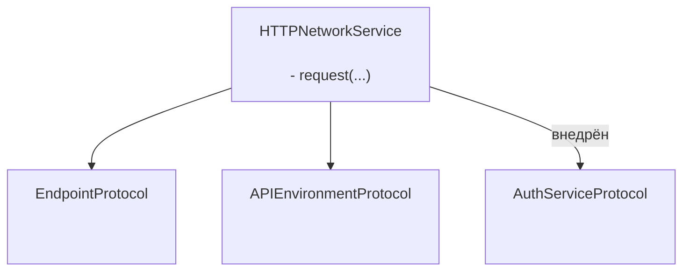
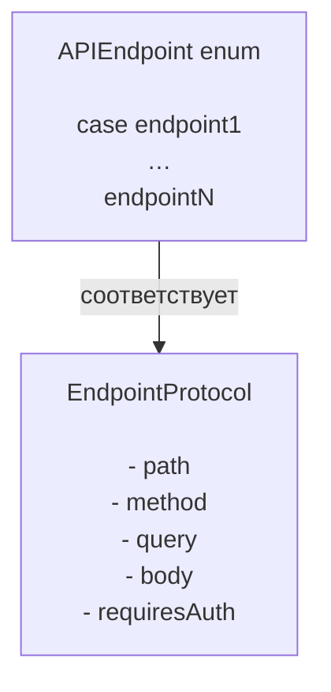

# GentleNetworking

Легковесная сетевая библиотека с поддержкой Swift 6, разработанная для современных iOS-приложений с использованием `async/await`, чистой архитектуры и тестируемых абстракций.

> 🌍 **Язык** · [English](../README.md) · [Español](README.es.md) · [Português (Brasil)](README.pt-BR.md) · [日本語](README.ja.md) · [简体中文](README.zh-CN.md) · [한국어](README.ko.md) · Русский

[](https://github.com/gentle-giraffe-apps/GentleNetworking/actions/workflows/ci.yml?query=branch%3Amain)
[](https://codecov.io/gh/gentle-giraffe-apps/GentleNetworking)
[](https://swift.org)
[](https://swift.org/package-manager/)
[](https://developer.apple.com/ios/)


[](https://deepsource.io/)
[](https://app.deepsource.com/gh/gentle-giraffe-apps/GentleNetworking/)

---

## ✨ Возможности

- ✅ Нативный `async/await` API
- ✅ Сетевой слой на основе протоколов с полной поддержкой моков
- ✅ Типизированное декодирование запросов / ответов
- ✅ Совместимость с Swift 6 + Swift Concurrency
- ✅ Спроектирован для MVVM / Clean Architecture
- ✅ Ноль сторонних зависимостей
- ✅ Встроенные Transport'ы с предустановленными ответами для тестирования

💬 **[Присоединяйтесь к обсуждению. Обратная связь и вопросы приветствуются](https://github.com/gentle-giraffe-apps/GentleNetworking/discussions)**

---

## Демо-приложение

В этом репозитории содержится запускаемое демо-приложение на SwiftUI с локальной ссылкой на пакет.

### Как запустить
1. Клонируйте репозиторий:
   ```bash
   git clone https://github.com/gentle-giraffe-apps/GentleNetworking.git
   ```
2. Откройте демо-проект:
   ```
   Demo/GentleNetworkingDemo/GentleNetworkingDemo.xcodeproj
   ```
3. Выберите симулятор с iOS 17+.
4. Соберите и запустите (⌘R).

Проект предварительно настроен с локальной ссылкой на Swift Package `GentleNetworking` и должен работать без дополнительной настройки.

---

## 📦 Установка (Swift Package Manager)

### Через Xcode

1. Откройте ваш проект в Xcode
2. Перейдите в **File → Add Packages...**
3. Введите URL репозитория: `https://github.com/gentle-giraffe-apps/GentleNetworking.git`
4. Выберите правило версионирования (или `main` во время разработки)
5. Добавьте продукт **GentleNetworking** в целевой модуль вашего приложения

### Через Package.swift

Добавьте зависимость в ваш `Package.swift`:

``` swift
dependencies: [
    .package(url: "https://github.com/gentle-giraffe-apps/GentleNetworking.git", from: "1.0.0")
]
```

Затем добавьте `"GentleNetworking"` в нужный целевой модуль:

``` swift
.target(
    name: "YourApp",
    dependencies: ["GentleNetworking"]
)
```

---

## Качество и инструменты

Этот проект обеспечивает контроль качества через CI и статический анализ:

- **CI:** Все коммиты в `main` должны пройти проверки GitHub Actions
- **Статический анализ:** DeepSource запускается при каждом коммите в `main`.
  Бейдж показывает текущее количество нерешённых проблем статического анализа.
- **Покрытие тестами:** Codecov отчитывается о покрытии строк для ветки `main`

<sub><strong>Снимок Codecov</strong></sub><br/>
<a href="https://codecov.io/gh/gentle-giraffe-apps/GentleNetworking"></a>

Эти проверки предназначены для безопасного развития системы дизайна с течением времени.

---

## Архитектура

GentleNetworking построен вокруг единого протокол-ориентированного `HTTPNetworkService`, который координирует запросы с помощью внедрённых абстракций эндпоинтов, окружения и аутентификации.



### Эндпоинт



## 🚀 Базовое использование

### 1. Определить API и эндпоинты

``` swift
import GentleNetworking

let apiEnvironment = DefaultAPIEnvironment(
    baseURL: URL(string: "https://api.company.com")
)

nonisolated enum APIEndpoint: EndpointProtocol {
    case signIn(username: String, password: String)
    case model(id: Int)
    case models

    var path: String {
        switch self {
        case .signIn: "/api/signIn"
        case .model(let id): "/api/model/\(id)"
        case .models: "/api/models"
        }
    }

    var method: HTTPMethod {
        switch self {
        case .signIn: .post
        case .model, .models: .get
        }
    }

    var query: [URLQueryItem]? {
        switch self {
        case .signIn, .model, .models: nil
        }
    }

    var body: [String: EndpointAnyEncodable]? {
        switch self {
        case .signIn(let username, let password): [
            "username": EndpointAnyEncodable(username),
            "password": EndpointAnyEncodable(password)
        ]
        case .model, .models: nil
        }
    }

    var requiresAuth: Bool {
        switch self {
        case .model, .models: true
        case .signIn(username: _, password: _): false
        }
    }
}
```

---

### 2. Создать сетевой сервис

``` swift
let networkService = HTTPNetworkService()
```

---

### 3. Аутентификация при необходимости

`SystemKeyChainAuthService` — это встроенная реализация `AuthServiceProtocol`. Она сохраняет Bearer-токен в системном keychain и автоматически прикрепляет его к запросам эндпоинтов, где `requiresAuth` равен `true`.

``` swift
let keyChainAuthService = SystemKeyChainAuthService()

struct AuthTokenModel: Decodable, Sendable {
    let token: String
}

let authTokenModel: AuthTokenModel = try await networkService.request(
    to: .signIn(username: "user", password: "pass"),
    via: apiEnvironment
)

try await keyChainAuthService.saveAccessToken(
    authTokenModel.token
)
```

---
### 4. Запросить модель

Используйте `request` для декодирования одного объекта из ответа:

``` swift
struct Model: Decodable, Sendable {
    let id: Int
    let property: String
}

let model: Model = try await networkService.request(
    to: .model(id: 123),
    via: apiEnvironment
)
```

---
### 5. Запросить массив моделей

Используйте `requestModels` для декодирования массива объектов из ответа:

``` swift
let models: [Model] = try await networkService.requestModels(
    to: .models,
    via: apiEnvironment
)
```

---

## 🧪 Тестирование

GentleNetworking предоставляет абстракцию транспортного слоя для удобного мокирования в тестах.

### CannedResponseTransport

Возвращает фиксированный ответ на любой запрос:

``` swift
let transport = CannedResponseTransport(
    string: #"{"id": 1, "title": "Test"}"#,
    statusCode: 200
)

let networkService = HTTPNetworkService(transport: transport)
```

### CannedRoutesTransport

Сопоставляет запросы по методу и шаблону пути для более реалистичных тестовых сценариев:

``` swift
let transport = CannedRoutesTransport(routes: [
    CannedRoute(
        pattern: RequestPattern(method: .get, path: "/api/models"),
        response: CannedResponse(string: #"[{"id": 1}]"#)
    ),
    CannedRoute(
        pattern: RequestPattern(method: .post, pathRegex: "^/api/model/\\d+$"),
        response: CannedResponse(string: #"{"success": true}"#)
    )
])

let networkService = HTTPNetworkService(transport: transport)
```

---

## 🧭 Философия проектирования

GentleNetworking построен на следующих принципах:

- ✅ Предсказуемость вместо магии
- ✅ Протокол-ориентированный дизайн
- ✅ Явное внедрение зависимостей
- ✅ Современная конкурентность Swift
- ✅ Тестируемость по умолчанию
- ✅ Малая площадь API с надёжными гарантиями

Библиотека намеренно минималистична и избегает чрезмерной абстракции или сокрытия сетевого поведения.

---

## 🤖 Примечание об инструментах

Часть черновой работы и редакторской доработки в этом репозитории была ускорена с помощью больших языковых моделей (включая ChatGPT, Claude и Gemini) при непосредственном контроле, валидации и финальном утверждении человеком. Все технические решения, код и архитектурные выводы написаны и проверены мейнтейнером репозитория.

---

## 🔐 Лицензия

Лицензия MIT
Бесплатно для личного и коммерческого использования.

---

## 👤 Автор

Создано **Jonathan Ritchey**
Gentle Giraffe Apps
Senior iOS Engineer --- Swift | SwiftUI | Concurrency


