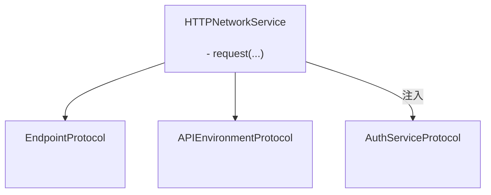
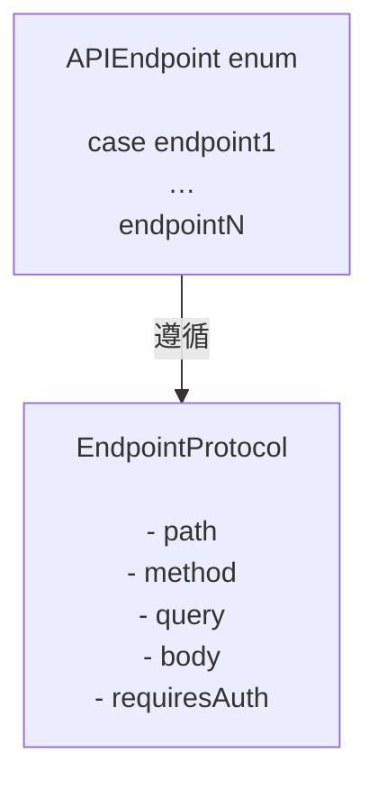

# GentleNetworking

一个轻量级、支持 Swift 6 的网络库，专为使用 `async/await`、整洁架构和可测试抽象的现代 iOS 应用设计。

> 🌍 **语言** · [English](../README.md) · [Español](README.es.md) · [Português (Brasil)](README.pt-BR.md) · [日本語](README.ja.md) · 简体中文 · [한국어](README.ko.md) · [Русский](README.ru.md)

[](https://github.com/gentle-giraffe-apps/GentleNetworking/actions/workflows/ci.yml?query=branch%3Amain)
[](https://codecov.io/gh/gentle-giraffe-apps/GentleNetworking)
[](https://swift.org)
[](https://swift.org/package-manager/)
[](https://developer.apple.com/ios/)


[](https://deepsource.io/)
[](https://app.deepsource.com/gh/gentle-giraffe-apps/GentleNetworking/)

---

## ✨ 特性

- ✅ 原生 `async/await` API
- ✅ 基于协议、完全可 Mock 的网络层
- ✅ 类型化的请求 / 响应解码
- ✅ 兼容 Swift 6 + Swift Concurrency
- ✅ 为 MVVM / Clean Architecture 设计
- ✅ 零第三方依赖
- ✅ 内置预设响应 Transport，方便测试

💬 **[加入讨论。欢迎反馈和提问](https://github.com/gentle-giraffe-apps/GentleNetworking/discussions)**

---

## 演示应用

本仓库包含一个可运行的 SwiftUI 演示应用，使用本地包引用。

### 运行方法
1. 克隆仓库：
   ```bash
   git clone https://github.com/gentle-giraffe-apps/GentleNetworking.git
   ```
2. 打开演示项目：
   ```
   Demo/GentleNetworkingDemo/GentleNetworkingDemo.xcodeproj
   ```
3. 选择一个 iOS 17+ 模拟器。
4. 构建并运行（⌘R）。

项目已预配置了对 `GentleNetworking` 的本地 Swift Package 引用，无需额外设置即可运行。

---

## 📦 安装（Swift Package Manager）

### 通过 Xcode

1. 在 Xcode 中打开你的项目
2. 前往 **File → Add Packages...**
3. 输入仓库 URL：`https://github.com/gentle-giraffe-apps/GentleNetworking.git`
4. 选择版本规则（或在开发期间使用 `main`）
5. 将 **GentleNetworking** 产品添加到你的应用目标

### 通过 Package.swift

在你的 `Package.swift` 中添加依赖：

``` swift
dependencies: [
    .package(url: "https://github.com/gentle-giraffe-apps/GentleNetworking.git", from: "1.0.0")
]
```

然后将 `"GentleNetworking"` 添加到需要它的目标中：

``` swift
.target(
    name: "YourApp",
    dependencies: ["GentleNetworking"]
)
```

---

## 质量与工具

本项目通过 CI 和静态分析实施质量门控：

- **CI：** 所有提交到 `main` 的代码必须通过 GitHub Actions 检查
- **静态分析：** DeepSource 在每次提交到 `main` 时运行。
  徽章显示当前未解决的静态分析问题数量。
- **测试覆盖率：** Codecov 报告 `main` 分支的行覆盖率

<sub><strong>Codecov 快照</strong></sub><br/>
<a href="https://codecov.io/gh/gentle-giraffe-apps/GentleNetworking"></a>

这些检查旨在确保设计系统能够安全地持续演进。

---

## 架构

GentleNetworking 以单一的、基于协议驱动的 `HTTPNetworkService` 为核心，使用注入的端点、环境和认证抽象来协调请求。



### 端点



## 🚀 基本用法

### 1. 定义 API 和端点

``` swift
import GentleNetworking

let apiEnvironment = DefaultAPIEnvironment(
    baseURL: URL(string: "https://api.company.com")
)

nonisolated enum APIEndpoint: EndpointProtocol {
    case signIn(username: String, password: String)
    case model(id: Int)
    case models

    var path: String {
        switch self {
        case .signIn: "/api/signIn"
        case .model(let id): "/api/model/\(id)"
        case .models: "/api/models"
        }
    }

    var method: HTTPMethod {
        switch self {
        case .signIn: .post
        case .model, .models: .get
        }
    }

    var query: [URLQueryItem]? {
        switch self {
        case .signIn, .model, .models: nil
        }
    }

    var body: [String: EndpointAnyEncodable]? {
        switch self {
        case .signIn(let username, let password): [
            "username": EndpointAnyEncodable(username),
            "password": EndpointAnyEncodable(password)
        ]
        case .model, .models: nil
        }
    }

    var requiresAuth: Bool {
        switch self {
        case .model, .models: true
        case .signIn(username: _, password: _): false
        }
    }
}
```

---

### 2. 创建网络服务

``` swift
let networkService = HTTPNetworkService()
```

---

### 3. 按需进行认证

`SystemKeyChainAuthService` 是 `AuthServiceProtocol` 的内置实现。它将 Bearer 令牌存储在系统钥匙串中，并自动将其附加到 `requiresAuth` 为 `true` 的端点请求上。

``` swift
let keyChainAuthService = SystemKeyChainAuthService()

struct AuthTokenModel: Decodable, Sendable {
    let token: String
}

let authTokenModel: AuthTokenModel = try await networkService.request(
    to: .signIn(username: "user", password: "pass"),
    via: apiEnvironment
)

try await keyChainAuthService.saveAccessToken(
    authTokenModel.token
)
```

---
### 4. 请求单个模型

使用 `request` 从响应中解码单个对象：

``` swift
struct Model: Decodable, Sendable {
    let id: Int
    let property: String
}

let model: Model = try await networkService.request(
    to: .model(id: 123),
    via: apiEnvironment
)
```

---
### 5. 请求模型数组

使用 `requestModels` 从响应中解码对象数组：

``` swift
let models: [Model] = try await networkService.requestModels(
    to: .models,
    via: apiEnvironment
)
```

---

## 🧪 测试

GentleNetworking 提供传输层抽象，便于在测试中进行 Mock。

### CannedResponseTransport

为任何请求返回固定响应：

``` swift
let transport = CannedResponseTransport(
    string: #"{"id": 1, "title": "Test"}"#,
    statusCode: 200
)

let networkService = HTTPNetworkService(transport: transport)
```

### CannedRoutesTransport

通过方法和路径模式匹配请求，适用于更真实的测试场景：

``` swift
let transport = CannedRoutesTransport(routes: [
    CannedRoute(
        pattern: RequestPattern(method: .get, path: "/api/models"),
        response: CannedResponse(string: #"[{"id": 1}]"#)
    ),
    CannedRoute(
        pattern: RequestPattern(method: .post, pathRegex: "^/api/model/\\d+$"),
        response: CannedResponse(string: #"{"success": true}"#)
    )
])

let networkService = HTTPNetworkService(transport: transport)
```

---

## 🧭 设计理念

GentleNetworking 围绕以下原则构建：

- ✅ 可预测性优于魔法
- ✅ 协议驱动设计
- ✅ 显式依赖注入
- ✅ 现代 Swift 并发
- ✅ 默认可测试
- ✅ 小巧的 API 表面积，强大的保证

它有意保持精简，避免过度抽象或隐藏网络行为。

---

## 🤖 工具说明

本仓库中的部分起草和编辑优化工作借助了大型语言模型（包括 ChatGPT、Claude 和 Gemini）加速完成，但均在人工直接设计、验证和最终审批下进行。所有技术决策、代码和架构结论均由仓库维护者编写和验证。

---

## 🔐 许可证

MIT 许可证
可免费用于个人和商业用途。

---

## 👤 作者

由 **Jonathan Ritchey** 构建
Gentle Giraffe Apps
Senior iOS Engineer --- Swift | SwiftUI | Concurrency


