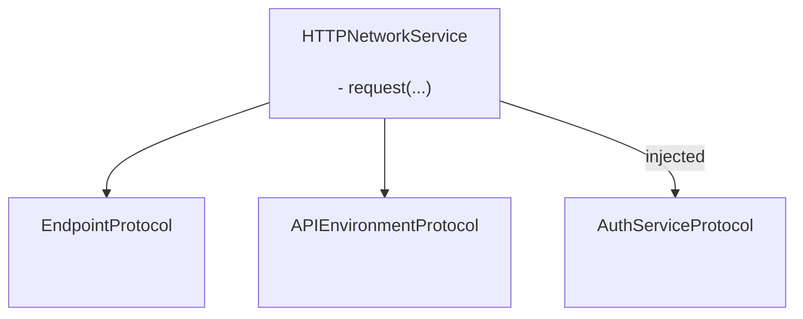
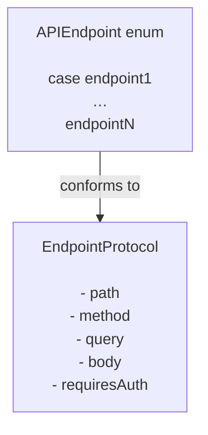

# GentleNetworking

A lightweight, Swift-6-ready networking library designed for modern iOS apps using `async/await`, clean architecture, and testable abstractions.

[](https://github.com/gentle-giraffe-apps/GentleNetworking/actions/workflows/ci.yml?query=branch%3Amain)
[](https://swift.org)
[](https://swift.org/package-manager/)
[](https://developer.apple.com/ios/)
[](LICENSE)

| Metric            | Trend |
|:------------------|:------|
| **Coverage** <br/> [](https://codecov.io/gh/gentle-giraffe-apps/GentleNetworking) | <a href="https://codecov.io/gh/gentle-giraffe-apps/GentleNetworking"></a> |
| **Static Analysis** | [](https://app.deepsource.com/gh/gentle-giraffe-apps/GentleNetworking/)<br/>[](https://app.deepsource.com/gh/gentle-giraffe-apps/GentleNetworking/) |

💬 **[Join the discussion. Feedback and questions welcome](https://github.com/gentle-giraffe-apps/GentleNetworking/discussions)**

---

## ✨ Features

- ✅ Native `async/await` API
- ✅ Protocol-based, fully mockable networking layer
- ✅ Typed request / response decoding
- ✅ Swift 6 + Swift Concurrency friendly
- ✅ Designed for MVVM / Clean Architecture
- ✅ Zero third-party dependencies
- ✅ Built-in canned response transports for testing

---

## Demo App

A runnable SwiftUI demo app is included in this repository using a local package reference.

### How to Run
1. Clone the repository:
   ```bash
   git clone https://github.com/gentle-giraffe-apps/GentleNetworking.git
   ```
2. Open the demo project:
   ```
   Demo/GentleNetworkingDemo/GentleNetworkingDemo.xcodeproj
   ```
3. Select an iOS 17+ simulator.
4. Build & Run (⌘R).

The project is preconfigured with a local Swift Package reference to `GentleNetworking` and should run without any additional setup.

---

## 📦 Installation (Swift Package Manager)

### Via Xcode

1. Open your project in Xcode
2. Go to **File → Add Packages...**
3. Enter the repository URL: `https://github.com/gentle-giraffe-apps/GentleNetworking.git`
4. Choose a version rule (or `main` while developing)
5. Add the **GentleNetworking** product to your app target

---

## Quality & Tooling

This project enforces quality gates via CI and static analysis:

- **CI:** All commits to `main` must pass GitHub Actions checks
- **Static analysis:** DeepSource runs on every commit to `main`.  
  The badge indicates the current number of outstanding static analysis issues.
- **Test coverage:** Codecov reports line coverage for the `main` branch

These checks are intended to keep the design system safe to evolve over time.

---

## Architecture

GentleNetworking is centered around a single, protocol-driven `HTTPNetworkService` that coordinates requests using injected endpoint, environment, and authentication abstractions.




### Endpoint



## 🚀 Basic Usage

### 1. Define an API and Endpoints

``` swift
import GentleNetworking

    let apiEnvironment = DefaultAPIEnvironment(
        baseURL: URL(string: "https://api.company.com")
    )

    nonisolated enum APIEndpoint: EndpointProtocol {
        case signIn(username: String, password: String)
        case model(id: Int)
        case models
    
        var path: String {
            switch self {
            case .signIn: "/api/signIn"
            case .model(let id): "/api/model/\(id)"
            case .models: "/api/models"
            }
        }

        var method: HTTPMethod {
            switch self {
            case .signIn: .post
            case .model, .models: .get
            }
        }

        var query: [URLQueryItem]? {
            switch self {
            case .signIn, .model, .models: nil
            }
        }

        var body: [String: EndpointAnyEncodable]? {
            switch self {
            case .signIn(let username, let password): [
                "username": EndpointAnyEncodable(username),
                "password": EndpointAnyEncodable(password)
            ]
            case .model, .models: nil
            }
        }
        
        var requiresAuth: Bool {
            switch self {
            case .model, .models: true
            case .signIn(username: _, password: _): false
            }
        }
    }

```

---

### 2. Create a Network Service

``` swift
	let networkService = HTTPNetworkService()
```

---

### 3. Authenticate if Needed

``` swift
    let keyChainAuthService = SystemKeyChainAuthService()

    struct AuthTokenModel: Decodable, Sendable {
        let token: String
    }

    let authTokenModel: AuthTokenModel = try await networkService.request(
        to: .signIn(username: "user", password: "pass"),
        via: apiEnvironment
    )

    try await keyChainAuthService.saveAccessToken(
        authTokenModel.token
    )
```

---
### 4. Request a Model

``` swift
    struct Model: Decodable, Sendable {
        let id: Int
        let property: String
    }

	let model: Model = try await networkService.request(
        to: .model(id: 123),
        via: apiEnvironment
    )
```

---
### 5. Request an Array of Models

``` swift
	let models: [Model] = try await networkService.requestModels(
        to: .models, 
        via: apiEnvironment
    )
```

---

## 🧪 Testing

GentleNetworking provides a transport-layer abstraction for easy mocking in tests.

### CannedResponseTransport

Returns a fixed response for any request:

``` swift
let transport = CannedResponseTransport(
    string: #"{"id": 1, "title": "Test"}"#,
    statusCode: 200
)

let networkService = HTTPNetworkService(transport: transport)
```

### CannedRoutesTransport

Match requests by method and path pattern for more realistic test scenarios:

``` swift
let transport = CannedRoutesTransport(routes: [
    CannedRoute(
        pattern: RequestPattern(method: .get, path: "/api/models"),
        response: CannedResponse(string: #"[{"id": 1}]"#)
    ),
    CannedRoute(
        pattern: RequestPattern(method: .post, pathRegex: "^/api/model/\\d+$"),
        response: CannedResponse(string: #"{"success": true}"#)
    )
])

let networkService = HTTPNetworkService(transport: transport)
```

---

## 🧭 Design Philosophy

GentleNetworking is built around:

- ✅ Predictability over magic
- ✅ Protocol-driven design
- ✅ Explicit dependency injection
- ✅ Modern Swift concurrency
- ✅ Testability by default
- ✅ Small surface area with strong guarantees

It is intentionally minimal and avoids over-abstracting or hiding
networking behavior.

---

## 🤖 Tooling Note

Portions of drafting and editorial refinement in this repository were accelerated using large language models (including ChatGPT, Claude, and Gemini) under direct human design, validation, and final approval. All technical decisions, code, and architectural conclusions are authored and verified by the repository maintainer.

---

## 🔐 License

MIT License
Free for personal and commercial use.

---

## 👤 Author

Built by **Jonathan Ritchey**
Gentle Giraffe Apps
Senior iOS Engineer --- Swift | SwiftUI | Concurrency


