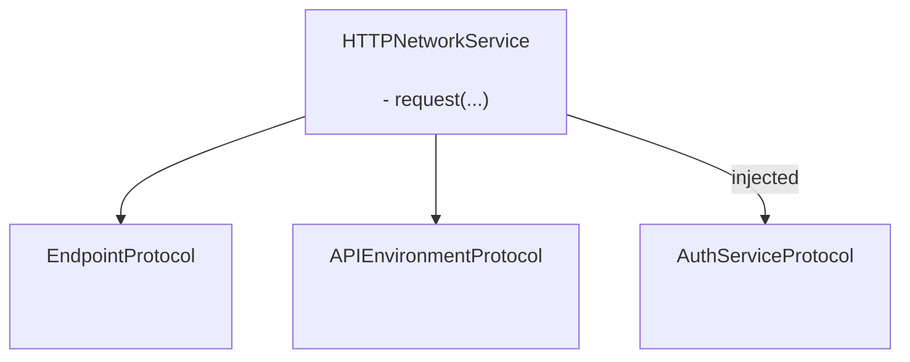
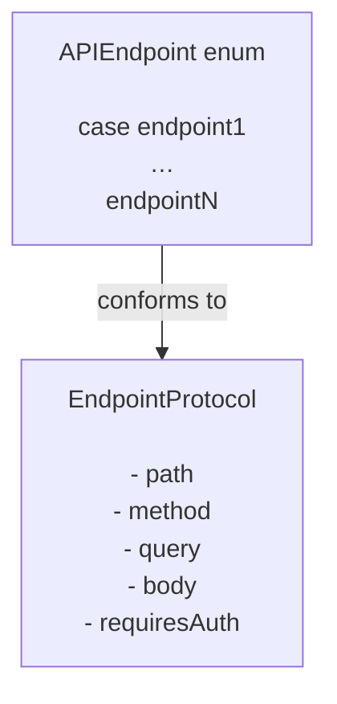

# GentleNetworking

**GentleNetworking** is a lightweight, Swift-6-ready networking library
designed for modern iOS apps using `async/await`, clean architecture,
and testable abstractions.

[](https://swift.org)
[](https://swift.org/package-manager/)
[](https://developer.apple.com/)
[](#)
[](LICENSE)

---

## ✨ Features

- ✅ Native `async/await` API
- ✅ Protocol-based, fully mockable networking layer
- ✅ Typed request / response decoding
- ✅ Swift 6 + Swift Concurrency friendly
- ✅ Designed for MVVM / Clean Architecture
- ✅ Zero third-party dependencies

---

## 📦 Installation (Swift Package Manager)

### Via Xcode

1. Open your project in Xcode
2. Go to **File → Add Packages...**
3. Enter the repository URL: `https://github.com/gentle-giraffe-apps/GentleNetworking.git`
4. Choose a version rule (or `main` while developing)
5. Add the **GentleNetworking** product to your app target

---

## Architecture

GentleNetworking is centered around a single, protocol-driven `HTTPNetworkService` that coordinates requests using injected endpoint, environment, and authentication abstractions.




### Endpoint



## 🚀 Basic Usage

### 1. Define an API and Endpoints

``` swift
import GentleNetworking

    let apiEnvironment = DefaultAPIEnvironment(
        baseURL: URL(string: "https://api.company.com")
    )

    enum APIEndpoint {
        case signIn(username: String, password: String)
        case model(id: Int)
        case models
    }

    extension APIEndpoint: EndpointProtocol {
    
        var path: String {
            switch self {
            case .signIn: "/api/signIn"
            case .model(let id): "/api/model/\(id)"
            case .models: "/api/models"
            }
        }

        var method: HTTPMethod {
            switch self {
            case .signIn: .post
            case .model, .models: .get
            }
        }

        var query: [URLQueryItem]? {
            switch self {
            case .signIn, .model, .models: nil
            }
        }

        var body: [String: Any]? {
            switch self {
            case .signIn(let username, let password): [ "username": username, "password": password ]
            case .model, .models: nil
            }
        }
        
        var requiresAuth: Bool {
            switch self {
            case .model, .models: true
            case .signIn(username: _, password: _): false
            }
        }
    }

```

---

### 2. Create a Network Service

``` swift
	let networkService = HTTPNetworkService(authService: keyChainAuthService)
```

---

### 3. Authenticate if Needed

``` swift
    let keyChainAuthService = SystemKeyChainAuthService()

    struct AuthTokenModel: Decodable, Sendable {
        let token: String
    }

    let authTokenModel: AuthTokenModel = try await networkService.request(
        to: .signIn(username, password),
        via: apiEnvironment
    )

    try keyChainAuthService.saveAccessToken(
        authTokenModel.token
    )
```

---
### 4. Request a Model

``` swift
    struct Model: Decodable, Sendable {
        let id: Int
        let property: String
    }

	let model: Model = try await networkService.request(
        to: .model, 
        via: apiEnvironment
    )
```

---
### 5. Request an Array of Models

``` swift
	let models: [Model] = try await networkService.requestModels(
        to: .models, 
        via: apiEnvironment
    )
```

---

## 🧭 Design Philosophy

GentleNetworking is built around:

- ✅ Predictability over magic
- ✅ Protocol-driven design
- ✅ Explicit dependency injection
- ✅ Modern Swift concurrency
- ✅ Testability by default
- ✅ Small surface area with strong guarantees

It is intentionally minimal and avoids over-abstracting or hiding
networking behavior.

---

## 📱 Platform Support

- iOS 17+
- macOS 14+

Additional platforms can be added easily if needed.

---

## 🤖 Tooling Note

Portions of drafting and editorial refinement in this repository were accelerated using large language models (including ChatGPT, Claude, and Gemini) under direct human design, validation, and final approval. All technical decisions, code, and architectural conclusions are authored and verified by the repository maintainer.

---

## 🔐 License

MIT License
Free for personal and commercial use.

---

## 👤 Author

Built by **Jonathan Ritchey**
Gentle Giraffe Apps
Senior iOS Engineer --- Swift | SwiftUI | Concurrency
